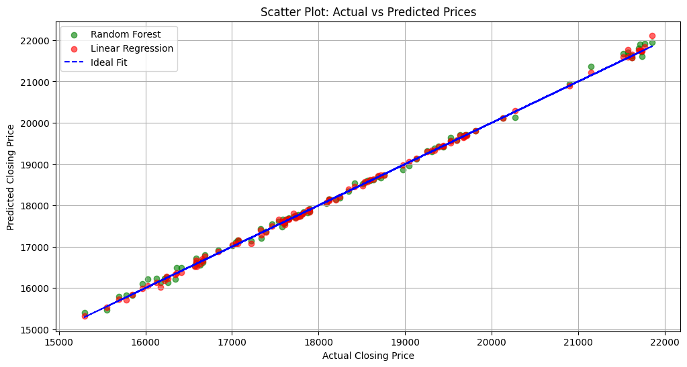
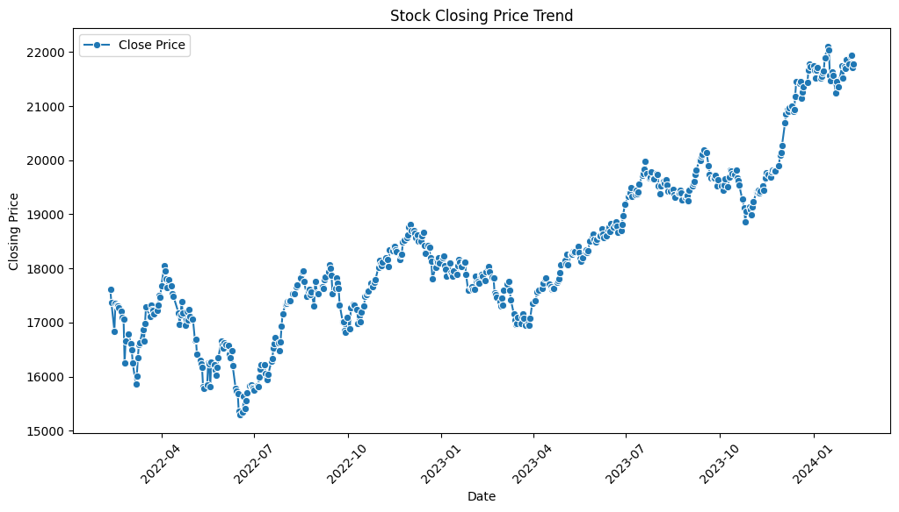
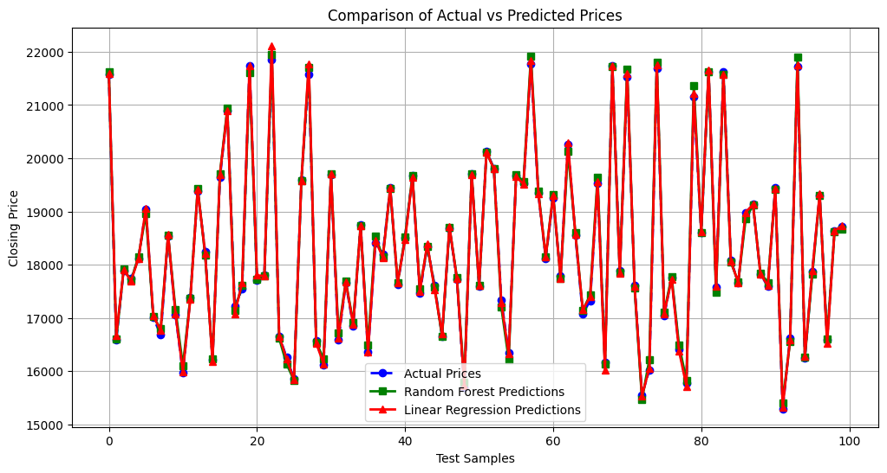
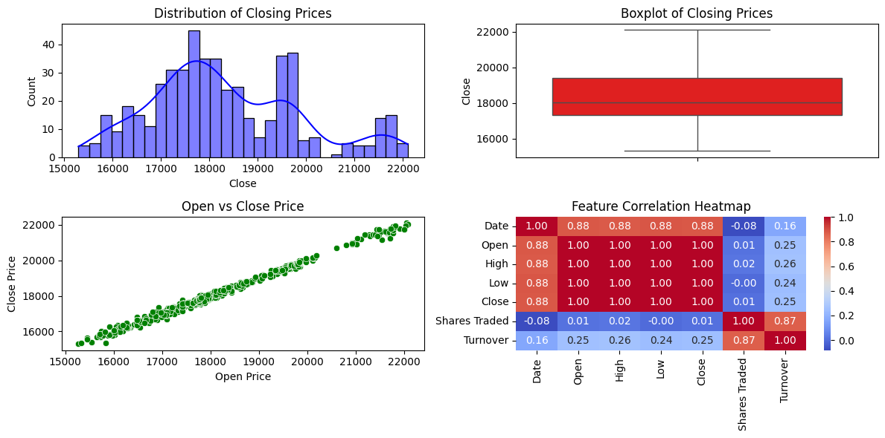

# Nifty 50 Stock Price Prediction Model

This project aims to predict the closing price of the Nifty 50 stock index using historical data. Two different machine learning models, **Random Forest Regressor** and **Linear Regression**, are built and evaluated to compare their performance on this prediction task.

---

## 📊 Project Overview

The project follows a standard machine learning workflow:
1.  **Data Loading & Preprocessing:** The historical stock data is loaded from an Excel file, cleaned, and prepared for analysis.
2.  **Exploratory Data Analysis (EDA):** Key trends, distributions, and correlations within the data are visualized to gain insights.
3.  **Feature Selection:** Relevant features are selected to train the models.
4.  **Model Training:** The dataset is split into training and testing sets, and both Random Forest and Linear Regression models are trained.
5.  **Performance Evaluation:** The models are evaluated using various regression metrics to determine their accuracy and effectiveness.
6.  **Visualization of Results:** The predictions from both models are plotted against the actual prices for a clear visual comparison.

---

## 📈 Dataset

The dataset used is historical Nifty 50 stock data contained in an Excel file.

* **Features (X):** `Open`, `High`, `Low`, `Shares Traded`, `Turnover`
* **Target (y):** `Close`

---

## 🛠️ Technologies Used

* Python
* Pandas
* NumPy
* Matplotlib
* Seaborn
* Scikit-learn

---

## ⚙️ Workflow & Methodology

1.  **Data Cleaning:**
    * Loaded the dataset from an Excel file.
    * Removed leading/trailing spaces from column names.
    * Converted the `Date` column to a standard datetime format.
    * Dropped any rows with missing values and sorted the data chronologically.

2.  **Exploratory Data Analysis (EDA):**
    * Visual analysis was performed to understand data distributions, relationships, and trends. The composite plot below shows the distribution of closing prices, a boxplot to identify outliers, the strong linear relationship between open and close prices, and a heatmap of feature correlations.
    

3.  **Model Training & Evaluation:**
    * The data was split into an 80% training set and a 20% testing set.
    * Two models were trained on the data:
        * `RandomForestRegressor`
        * `LinearRegression`
    * The models were evaluated using the following metrics: Mean Absolute Error (MAE), Mean Squared Error (MSE), Root Mean Squared Error (RMSE), R² Score, and Mean Absolute Percentage Error (MAPE).

---

## 🚀 Model Performance

Both models achieved very high performance on the test data, with R² scores of 1.00 indicating an almost perfect fit. The Linear Regression model showed slightly better performance across most metrics.

| Metric                      | Random Forest Regressor | Linear Regression |
| :-------------------------- | :---------------------- | :---------------- |
| Mean Absolute Error (MAE)   | 58.87                   | 37.79             |
| Root Mean Squared Error (RMSE)| 76.82                   | 54.74             |
| R² Score                    | 1.00                    | 1.00              |
| **Model Accuracy (100-MAPE)** | **99.68%** | **99.79%** |

---

## 🖼️ Visualizations

### Stock Closing Price Trend
This plot shows the historical trend of the Nifty 50 closing price from 2022 to 2024.


### Comparison of Actual vs. Predicted Prices
This line plot compares the actual closing prices with the predictions made by both models on the test set. Both models track the actual prices very closely.


### Scatter Plot of Predictions
This plot shows the correlation between the actual and predicted prices. The points lying close to the "Ideal Fit" line indicate high accuracy.


---

## 📋 How to Use

To run this project locally, follow these steps:

1.  **Clone the repository:**
    ```bash
    git clone https://github.com/ShrikarBende/Stock-Market-Prediction.git
    cd Stock-Market-Prediction
    ```

2.  **Install the required libraries:**
    ```bash
    pip install pandas numpy matplotlib seaborn scikit-learn openpyxl
    ```

3.  **Prepare the dataset:**
    * Place the `Nifty_50.xlsx` data file in the project's root directory.
    * **Important:** In the Jupyter Notebook, update the file path in the data loading cell to avoid errors:
        ```python
        # old path (example from a specific computer)
        df = pd.read_excel("C:/Users/YourUsername/Nifty_50.xlsx")
        
        # update to a relative path:
        df = pd.read_excel("Nifty_50.xlsx")
        ```

4.  **Run the Jupyter Notebook:**
    * Open and run the `Stock_Price_Prediction_Model_DS_CP.ipynb` file in a Jupyter environment.

---

## 📜 License

This project is licensed under the MIT License. See the [LICENSE](LICENSE) file for details.
